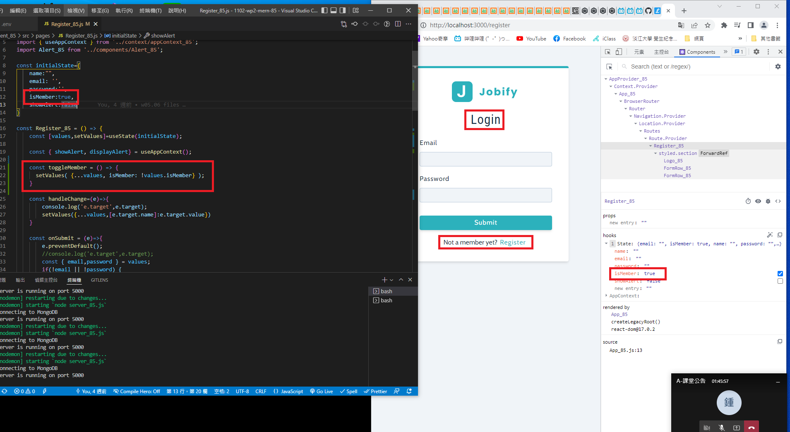
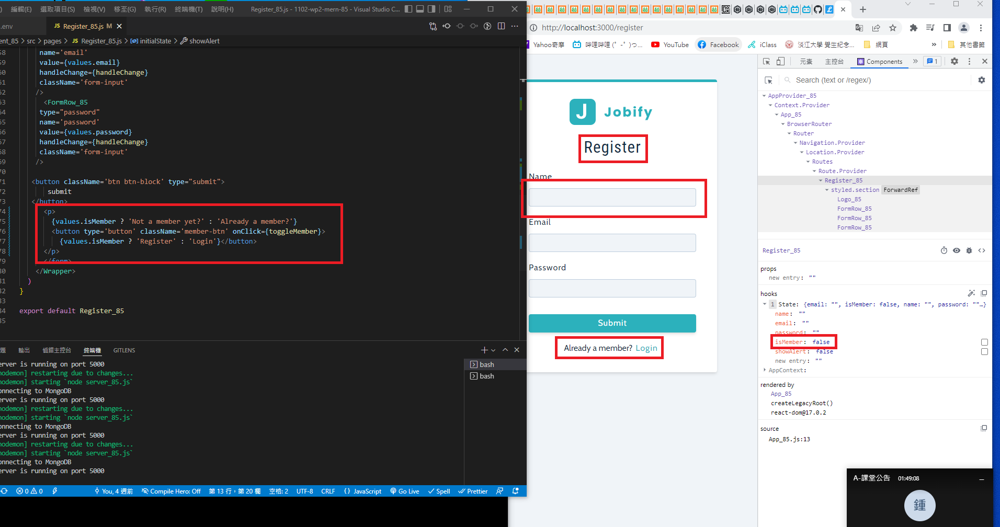
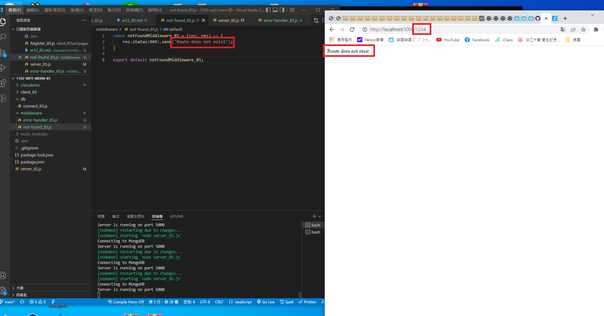
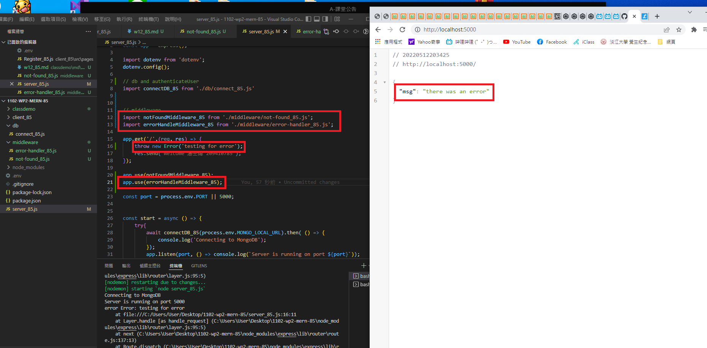
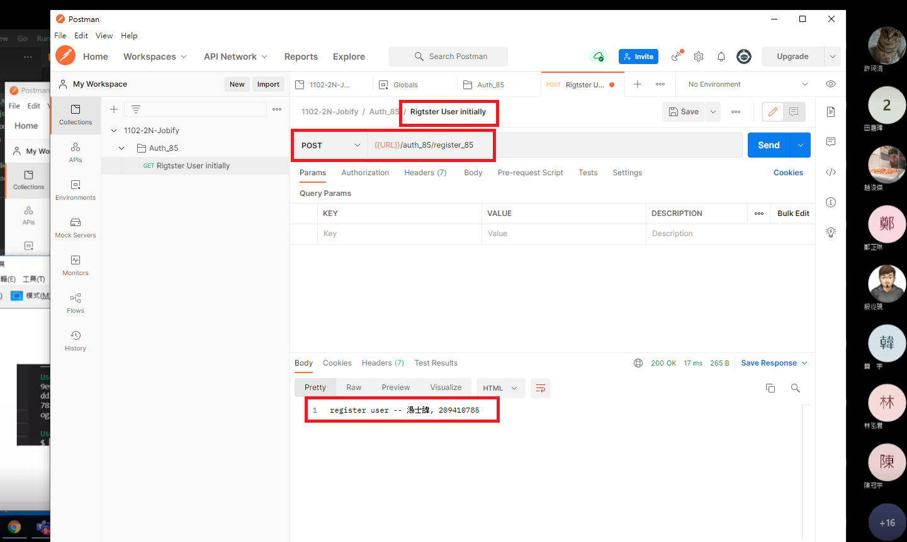
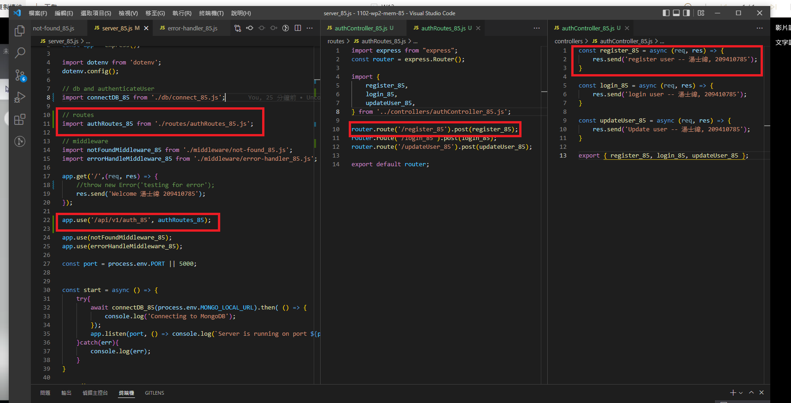
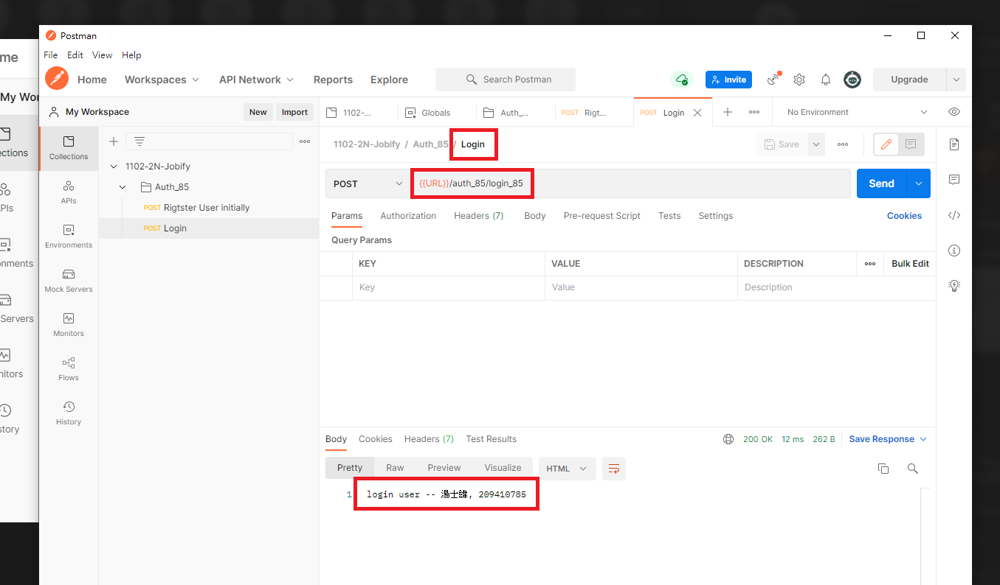
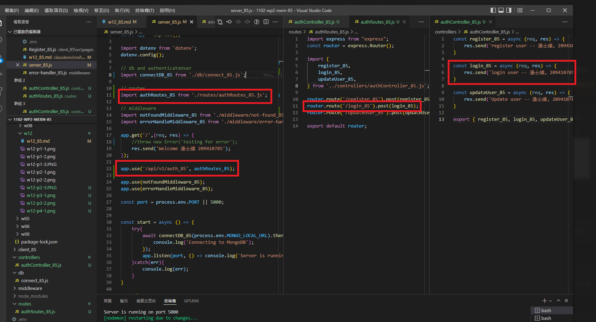
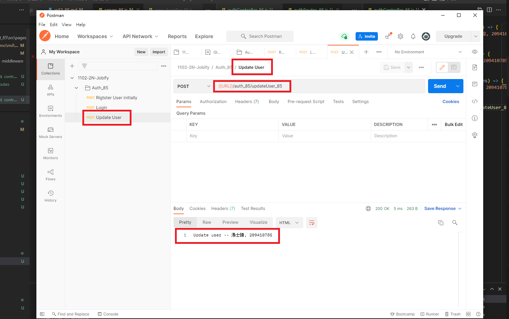
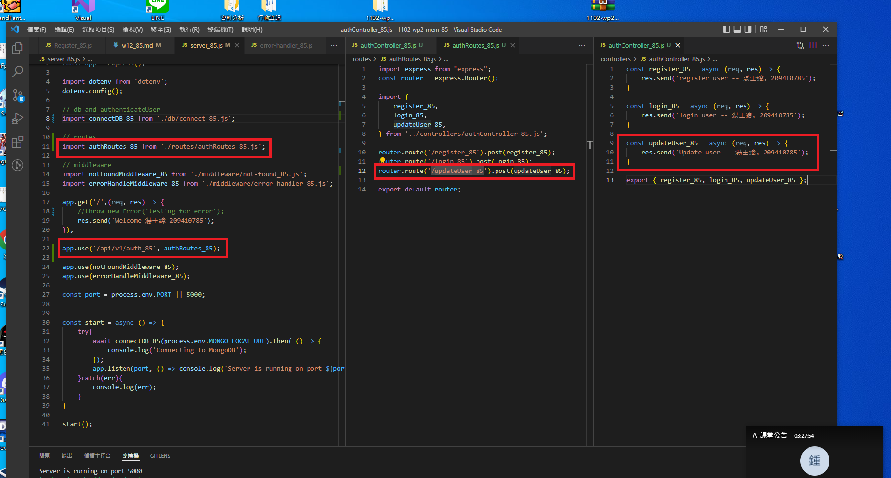

### w12-p1 switch Register and Login, and log





### w12-p2-1 test for notFoundMiddleware_85.js



### w12-p2-2 test for errorHandlerMiddleware_85.js




### w12-p3 Use postman to test route /api/v1/auth_85x/register_85




### w12-p4 Use postman to test route /api/v1/auth_xx/login_xx




### w12-p5 Use postman to test route /api/v1/auth_xx/updateUser_xx




### W12-LAST-LOG show all W12 log records in Github


```
$ git log --pretty=format:"%h%x09%an%x09%ad%x09%s" --after="2022-05-11"
1818697 tsw0603 Thu May 12 21:49:03 2022 +0800  w12-p3 Use postman to test route /api/v1/auth_85x/register_85, w12-p4 login, w12-p5 updateuser
7745f22 tsw0603 Thu May 12 20:39:34 2022 +0800  w12-p2-1 test for notFoundMiddleware_85.js, and w12-p2-2 test for errorHandlerMiddleware_85.js
50ba110 tsw0603 Thu May 12 20:09:30 2022 +0800  w12-p1 switch Register and Login
```
