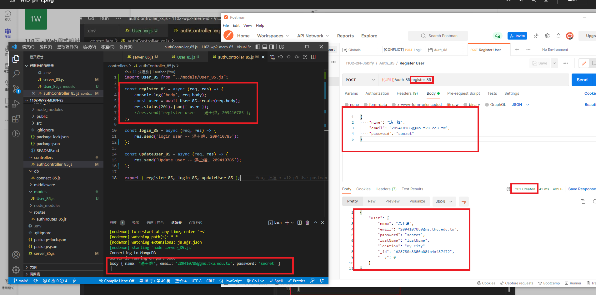

### Github repo URL

### w13-p1: create a user and save it into MongoDB, collection User_85




### w13-p2: use validator package to check email, error sent to error-handler_85.js


### w13-p3: hash password using bcryptjs


### w13-p4: create jwt token using bcryptjs


### p13-last-log


```
$ git log --pretty=format:"%h%x09%an%x09%ad%x09%s" --after="2022-05-18"
b85f353 tsw0603 Fri May 20 22:01:11 2022 +0800  ### w13-p4: create jwt token using bcryptjs
6ef658d tsw0603 Fri May 20 21:34:13 2022 +0800  w13-p3: hash password using bcryptjs
a4e8b7e tsw0603 Fri May 20 21:01:58 2022 +0800  w13-p2: use validator package to check email, error sent to error-handler_85.js
bb47b32 tsw0603 Fri May 20 20:01:51 2022 +0800  w13-p1: create a user and save it into MongoDB, collection User_85
```
