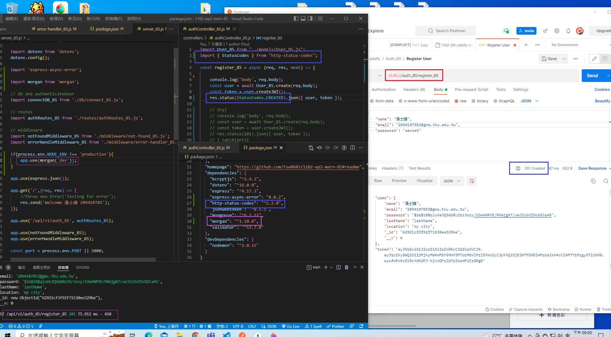
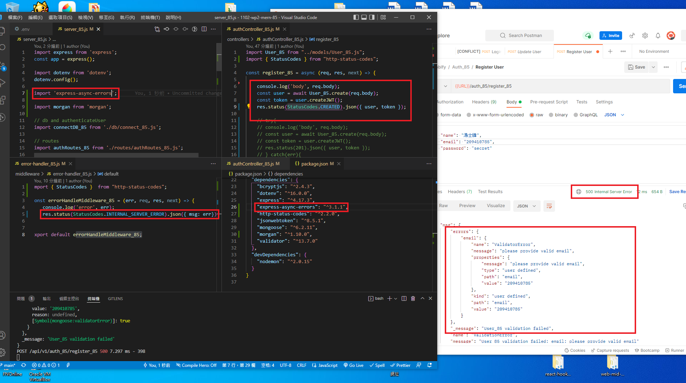
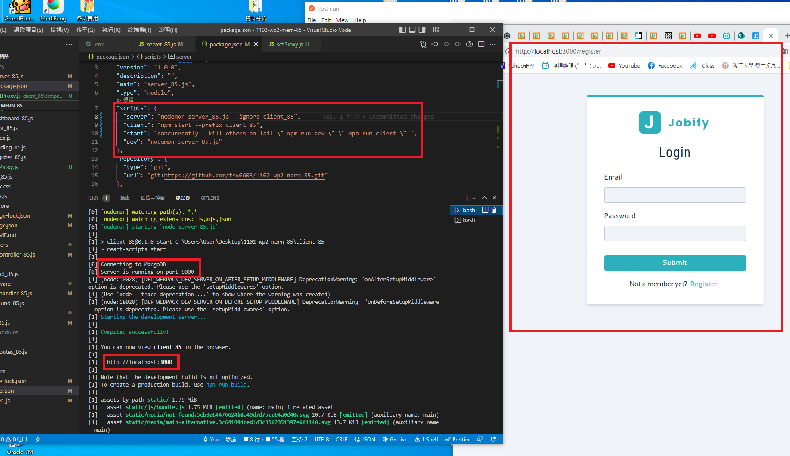
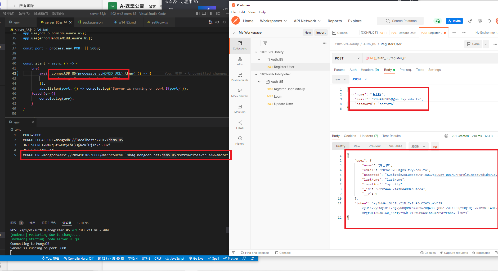
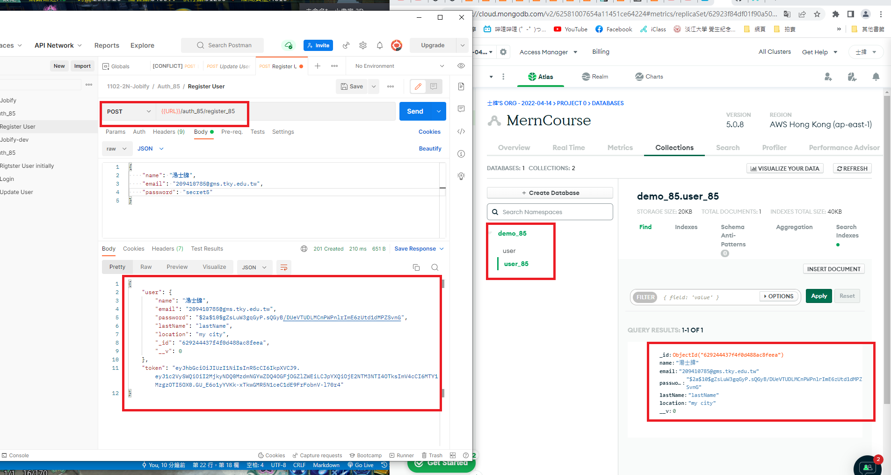

### w14-p1: install package http-status-codes, morgan, test it, and show it

### w14-p2: install express-async-errors and test it

### w14-p3: run server and client concurrently

### w14-p4: create mongodb atlas account

### w14-p5: register a user to MongoDB Atlas

