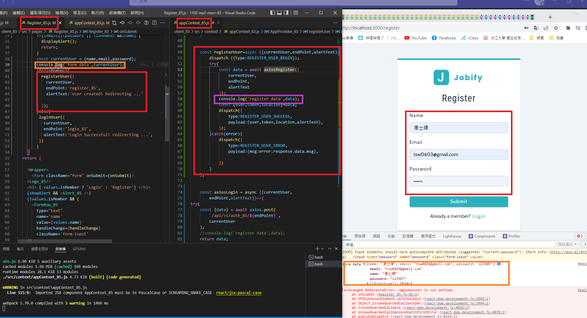
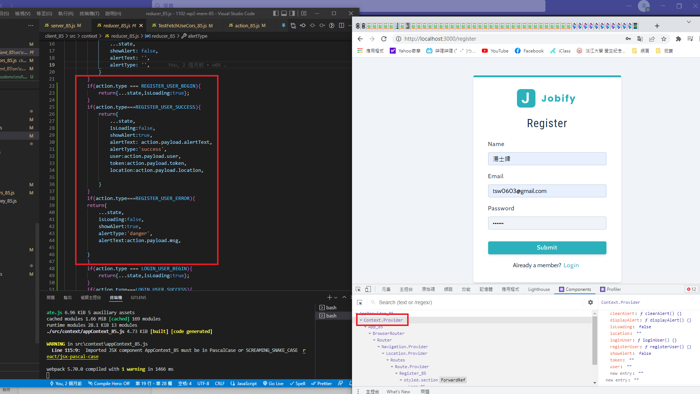
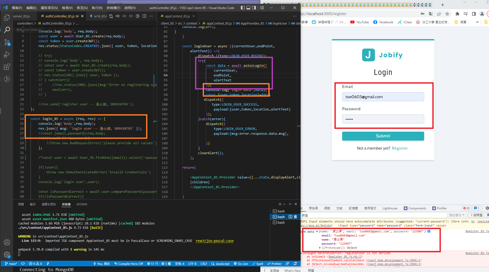
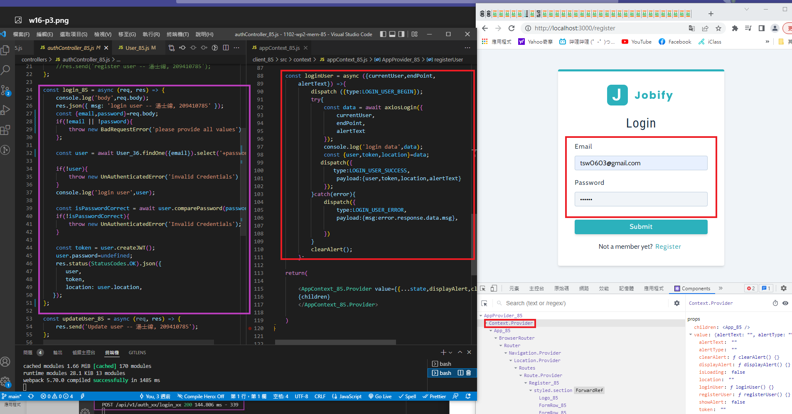

### w16-p1: registerUser okay, save { user, token, location} in appContext





### w16-p2: loginUser from client to server, test connection okay



### w16-p3: in server, check email and password for credentials, okay then return {user, token, location}



### p16-last-log


```
 $ git log --pretty=format:"%h%x09%an%x09%ad%x09%s" --after="2022-06-10"
a961103 tsw0603 Sat Jun 11 22:32:50 2022 +0800  w16-p3: in server, check email and password for credentials, okay then return {user, token, location}
01a027e tsw0603 Sat Jun 11 22:16:30 2022 +0800  w16-p2: loginUser from client to server, test connection okay
7e09c56 tsw0603 Sat Jun 11 21:59:37 2022 +0800  w16-p1: registerUser okay, save { user, token, location} in appContext

```
